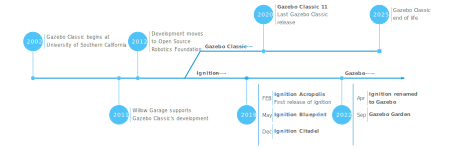

# Gazebo

## Daftar Isi

- [Gazebo](#gazebo)
  - [Daftar Isi](#daftar-isi)
  - [Definisi](#definisi)
  - [Instalasi](#instalasi)
    - [Gazebo Classic](#gazebo-classic)
    - [Gazebo Ignition](#gazebo-ignition)
    - [Gazebo Sim](#gazebo-sim)
    - [Gazebo Fortress](#gazebo-fortress)
      - [Instalasi Gazebo Fortress](#instalasi-gazebo-fortress)
  - [Konsep](#konsep)
    - [World](#world)
    - [Model](#model)
    - [Link](#link)
    - [Joint](#joint)
    - [Plugin](#plugin)
    - [Format Deskripsi](#format-deskripsi)
      - [SDF](#sdf)
      - [URDF](#urdf)
      - [Xacro](#xacro)
  - [Praktik](#praktik)
    - [Link](#link-1)
    - [Macros](#macros)
    - [Sensor](#sensor)
    - [Control](#control)
    - [Launch](#launch)
  - [Tugas](#tugas)
  - [Referensi](#referensi)

## Definisi

Gazebo adalah aplikasi simulasi realistis khusus untuk simulasi robot. Gazebo menyediakan berbagai jenis plugin dan sensor sehingga kami dapat melakukan simulasi dan robot yang sesuai dengan lingkungan nyata dan robot asli.

## Instalasi

Gazebo sebenarnya memiliki [beberapa versi](https://gazebosim.org/about ) yang pernah digunakan dalam pengembangan robotika. Namun tidak semua versi masih aktif digunakan sekarang.



### Gazebo Classic

Gazebo Classic adalah versi tertua dari Gazebo yang dikembangkan sejak era ROS 1.
Versi ini menggunakan fisika dasar dan interface lama.

### Gazebo Ignition

Gazebo Ignition merupakan penerus dari Gazebo Classic dengan peningkatan besar pada engine fisika, rendering, dan sistem plugin.

### Gazebo Sim

Gazebo Sim adalah generasi terbaru dari simulator Gazebo. Versi ini merupakan *rebranding* dari Gazebo Ignition
Rilis ini membawa dukungan skala besar, sensor baru, serta integrasi penuh dengan ROS 2.
Versi modern Gazebo menggunakan sistem rilis bernama huruf, seperti:

- Fortress (LTS) – stabil untuk ROS 2 Humble
- Harmonic (LTS) – untuk ROS 2 Jazzy
- Jetty (LTS terbaru) – untuk Ubuntu 24.04 dan ROS 2 Rolling/Jazzy+

### Gazebo Fortress
Versi-versi lama di atas sudah tidak kita gunakan lagi dan tidak perlu diperhatikan. Saat ini kita hanya menggunakan Gazebo Fortress saja.
Kenapa kita menggunakan versi Gazebo ini? Alasannya sederhana, karena integrasi ROS 2 Humble dengan Gazebo Fortress adalah yang paling stabil dan resmi direkomendasikan oleh developer ROS dan Gazebo.

#### Instalasi Gazebo Fortress
Instalasi dapat kalian lihat di [dokumentasi gazebo fortress](https://gazebosim.org/docs/all/ros_installation/)

Kita bisa menginstall Gazebo Fortress dengan command ini
```
sudo apt update
sudo apt install ros-humble-ros-gz-sim
```

## Konsep

Dalam Gazebo, terdapat berbagai konsep yang perlu dipahami untuk membuat simulasi. Berikut konsep-konsep tersebut.

### World

World merupakan lingkungan yang akan digunakan untuk simulasi robot. Secara default, world kalian akan berisi _plane_ besar saja.

### Model

Dalam Gazebo, setiap objek merupakan sebuah model. Model dapat berupa robot kalian, sebuah kotak, dan banyak berbagai macam hal yang dapat memiliki 1 atau lebih _link_.

### Link

Link merupakan komponen dari setiap model. Misalkan model kita berupa robot Narumusa, link yang terdapat pada model tersebut dapat berupa thruster, camera, badan, dan banyak lagi.

Dalam sebuah link, terdapat 3 komponen penting, yaitu:

-   Visual

    Visual mendefinisikan bagaimana bentuk visual sebuah link.

-   Collision

    Collision mendefinisikan bagaimana sebuah link berinteraksi secara fisik dalam sebuah simulasi. Apabila terdapat Collision dalam link, maka link juga memerlukan Inertial.

-   Inertial

    Inertial mendefinisikan distribusi massa pada sebuah link. Hal ini sangat penting untuk simulasi robot yang realistis.

### Joint

Joint merupakan hubungan antara 2 link. Terdapat berbagai macam jenis joint, seperti:

-   Fixed

    Tidak terdapat pergerakan dalam hubungan kedua link, sehingga child link akan mengikuti seluruh pergerakan parent link. Joint ini dapat digunakan apabila kita ingin menggabungkan 2 link menjadi sebuah kesatuan, seperti robot dengan kamera (kamera ga mungkin gerak2 dongs)

-   Revolute

    Adanya rotasi pada suatu axis dengan batasan tertentu, sehingga child link dapat berotasi terhadap parent link. Contoh dari joint ini adalah lengan robot.

-   Prismatic

    Adanya translasi pada suatu axis, sehingga child link dapat bertranslasi terhadap parent link. Contoh dari joint ini berupa sebuah slider.

Dan masih banyak lagi.

### Plugin

Plugin dapat diibaratkan seperti library dalam sebuah file. Library tersebut dapat memberi fungsi tambahan kepada file tersebut. Dalam kasus ini, plugin dapat menambah fitur kepada simulasi kita. Contohnya berupa plugin hidrodinamika dan buoyancy untuk simulasi air serta plugin thruster untuk mengubah sebuah link menjadi thruster robot.

### Format Deskripsi

Untuk "mendeskripsikan" berbagai world dan model kami, terdapat berbagai XML format yang tersedia, yaitu:

#### SDF

SDF (Simulation Description Format) merupakan format yang digunakan oleh Gazebo untuk mendeskripsikan robot.

Pros:

-   Dapat mendeskripsikan robot secara detail

Cons:

-   Nguli
-   Nguli
-   Nguli

#### URDF

URDF (Unified Robot Description Format) merupakan format yang digunakan oleh ROS untuk mendeskripsikan robot.

Namun mirisnya, Gazebo hanya dapat membaca format SDF saja. Untuk itu, kita perlu mengubah format URDF menjadi format SDF. Untuk mengubah formatnya, kita hanya perlu menjalankan:

```shell
gz sdf -p myrobot.urdf > myrobot.sdf	# Gazebo Classic
ign sdf -p myrobot.urdf > myrobot.sdf 	# Ignition dan seterusnya
```

Pros:

-   Memiliki integrasi ROS yang baik

Cons:

-   Masih nguli 🗿

Apabila kalian memiliki CAD model dari robot kalian, kalian dapat ubah CAD model tersebut menjadi URDF lewat cara-cara berikut:

-   [PTC Creo](https://github.com/icub-tech-iit/cad-libraries/wiki/Prepare-PTC-Creo-Mechanism-for-URDF)
-   [SolidWorks](http://wiki.ros.org/sw_urdf_exporter)
-   [Fusion](https://github.com/syuntoku14/fusion2urdf)
-   [OnShape](https://onshape-to-robot.readthedocs.io/en/latest/)
-   [Blender](https://github.com/dfki-ric/phobos)

#### Xacro

Xacro (XML with macros) merupakan format XML yang menyediakan fitur pembuatan macro, sehingga kita dapat membuat variabel dan macro serta menyesuaikan nilai variabel-variabel tersebut dan menggunakan macro secara berulang untuk menentukan deskripsi yang sesuai. Hal tersebut sangat mempermudah pembuatan deskripsi dan menghilangkan pengulangan redundan.

Namun, mengingat bahwa Gazebo hanya dapat membaca format SDF, kita perlu mengubah format Xacro menjadi SDF. Akan tetapi, Xacro hanya dapat diubah menjadi format URDF saja. Oleh sebab itu, kita perlu mengubah Xacro menjadi URDF lalu URDF menjadi SDF. Hal tersebut dapat dilakukan dengan cara berikut:

```shell
xacro myrobot.xacro > myrobot.urdf
gz sdf -p myrobot.urdf > myrobot.sdf
```

Pros:

-   Praktis karena adanya fitur pembuatan _macro_
-   Terdapat parser aritmatika sehingga properti dapat diperhitungkan daripada ketik manual

Cons:

-   Spawn hasil robot lebih ribet dibanding format lain

## Praktik

Dalam modul ini, kita akan menggunakan Gazebo Classic dan Xacro untuk mendefinisikan robot dan simulasi kita.

Dalam workspace, buatlah sebuah _package_ bernama _sim_ dengan perintah ini:

```shell
ros2 pkg create sim --build-type ament_cmake --license Apache2.0
```

Setelah itu, atur isi _package_ sehingga struktur _package_ terlihat seperti ini.

```
sim/
| config/
| description/
| src/
| CMakeLists.txt
| package.xml
+ LICENSE
```

Setelah itu, buatlah sebuah file bernama `robot.xacro` di folder `description` dengan isi seperti berikut:

```xml
<?xml version="1.0"?>
<robot xmlns:xacro="http://www.ros.org/wiki/xacro" name="robot">
	<!-- Include macros -->
	<!-- Args -->
	<!-- Properties -->
	<!-- Links and joints -->
</robot>
```

### Link

Dalam tag `robot`, tambahkan beberapa variabel yang kita akan gunakan dalam pembuatan robot selanjutnya.

```xml
<!-- Properties -->

<xacro:property name="chassis_mass" value="10" />
<xacro:property name="chassis_x" value="1" />
<xacro:property name="chassis_y" value="0.6" />
<xacro:property name="chassis_z" value="0.4" />
```

Lalu, tambahkan sebuah link. Dalam pembuatan link, gunakan properti yang telah kita buat sebelumnya.

```xml
<!-- Links and joints -->

<link name="chassis_link">
	<visual>
		<box size="${chassis_x} ${chassis_y} ${chassis_z}">
	</visual>
	<collision>
		<box size="${chassis_x} ${chassis_y} ${chassis_z}">
	</collision>
	<!-- Inertia disini -->
</link>
```

### Macros

Kita berhasil membuat sebuah link, namun kita belum menambahkan inertia. Mungkin saja kalian dapat menambahkan tag inertial ke dalam link seperti berikut:

```xml
<inertial>
	<origin x="0" y="0" z="0" />
	<mass value="${chassis_mass}" />
	<inertia ixx="${(1/12) * chassis_mass * (chassis_y * chassis_y + chassis_z * chassis_z)}" ixy="0" ixz="0"
			iyy="${(1/12) * chassis_mass * (chassis_x * chassis_x + chassis_z * chassis_z)}" iyz="0"
			izz="${(1/12) * chassis_mass * (chassis_x * chassis_x + chassis_y * chassis_y)}" />
</inertial>
```

Dapat dilihat bahwa proses penulisan tag inertial sangat nguli apabila ditulis secara terus menerus. Oleh sebab itu, kita dapat membuat sebuah _macro_ khusus untuk inertia. Untuk melakukan hal tersebut, buatlah sebuah file baru bernama `inertial_macro.xacro` di folder `description` dengan isi seperti berikut.

```xml
<?xml version="1.0"?>
<robot xmlns:xacro="http://www.ros.org/wiki/xacro">
	<xacro:macro name="inertial_box" params="mass x y z *origin">
		<xacro:insert_block name="origin">
		<mass value="${mass}" />
		<inertia ixx="${(1/12) * mass * (y * y + z * z)}" ixy="0" ixz="0"
			iyy="${(1/12) * mass * (x * x + z * z)}" iyz="0"
			izz="${(1/12) * mass * (x * x + y * y)}" />
	</xacro>
</robot>
```

Setelah itu, _include_ file tersebut ke dalam `robot.xacro`.

```xml
<!-- Include macros -->

<xacro:include filename="inertial_macros.xacro" />
```

Dan masukkan _macro_ tersebut ke dalam link.

```xml
<!-- Links and joints -->

<link name="chassis">
	<visual>
		<geometry>
			<box size="${chassis_x} ${chassis_y} ${chassis_z}">
		</geometry>
	</visual>
	<collision>
		<geometry>
			<box size="${chassis_x} ${chassis_y} ${chassis_z}">
		</geometry>
	</collision>
	<!-- Inertia disini -->
	<xacro:inertial_box mass="${chassis_mass}" x="${chassis_x}" y="${chassis_y}" />
</link>
```

### Sensor

Kami akan menambahkan sensor kamera pada robot kami. Untuk membuat hal tersebut, buatlah sebuah file baru bernama `camera.xacro` di direktori `description` dengan isi berikut:

```xml
<?xml version="1.0"?>
<robot xmlns:xacro="http://www.ros.org/wiki/xacro">

	<xacro:macro name="camera" params="*origin">

		<link name="camera_link">
			<visual>
				<box size="0.1 0.1 0.1" />
			</visual>
		</link>

		<joint name="chassis_camera_joint" type="fixed">
			<parent link="chassis_link" />
			<child link="camera_link" />
			<xacro:insert_block name="origin" />
		</joint>

		<link name="camera_frame_link" />

		<joint name="camera_frame_joint" type="fixed">
			<parent link="camera_link" />
			<child link="camera_frame_link" />
			<origin xyz="0 0 0" rpy="${-pi/2} 0 ${pi/2}" />
		</joint>

		<gazebo reference="camera_link">
			<sensor name="camera" type="camera">
				<pose>0 0 0 0 0 0</pose>
				<visualize>true</visualize>
				<update_rate>10</update_rate>
				<camera>
					<horizontal_fov>1.089</horizontal_fov>
					<image>
						<format>R8G8B8</format>
						<width>640</width>
						<height>480</height>
					</image>
					<clip>
						<near>0.01</near>
						<far>10.0</far>
					</clip>
				</camera>
				<plugin name="camera_controller" filename="libgazebo_ros_camera.so">
					<frame_name>camera_frame_link</frame_name>
				</plugin>
			</sensor>
		</gazebo>

	</xacro:macro>

</robot>
```

Dapat dilihat bahwa terdapat tag `<gazebo>` dalam mendefiniskan sensor. Hal ini disebabkan fitur-fitur sensor yang tidak sepenuhnya di _support_ oleh format selain SDF.

Setelah itu, kita dapat menggunakan macro tersebut dalam robot kita.

```xml
<!-- Links and joints -->

<link name="chassis">
	<visual>
		<geometry>
			<box size="${chassis_x} ${chassis_y} ${chassis_z}">
		</geometry>
	</visual>
	<collision>
		<geometry>
			<box size="${chassis_x} ${chassis_y} ${chassis_z}">
		</geometry>
	</collision>
	<!-- Inertia disini -->
	<xacro:inertial_box mass="${chassis_mass}" x="${chassis_x}" y="${chassis_y}" />
</link>

<xacro:camera>
	<origin xyz="${chassis_x / 2 + 0.01} 0 0" rpy="0 0 0" />
</xacro>
```

### Control

Untuk menambahkan sistem kontrol simpel yang terhubung pada ROS2. Buatlah sebuah file bernama `controller.cpp` yang berisi seperti berikut:
```cpp
#include <functional>
#include <memory>
#include <string>

#include <gazebo/gazebo.hh>
#include <gazebo/physics/physics.hh>
#include <gazebo/common/common.hh>
#include <ignition/math/Vector3.hh>
#include <gazebo_ros/conversions/geometry_msgs.hpp>
#include <gazebo_ros/node.hpp>

#include <rclcpp/rclcpp.hpp>
#include <geometry_msgs/msg/twist.hpp>
#include <geometry_msgs/msg/pose.hpp>
#include <geometry_msgs/msg/transform_stamped.hpp>
#include <nav_msgs/msg/odometry.hpp>
#include <sensor_msgs/msg/joint_state.hpp>

#include <tf2/LinearMath/Quaternion.h>
#include <tf2_geometry_msgs/tf2_geometry_msgs.hpp>
#include <tf2_ros/transform_broadcaster.h>

namespace gazebo
{
    class ROV_Controller : public ModelPlugin
    {
    public:
        void Load(physics::ModelPtr _model, sdf::ElementPtr _sdf)
        {
            this->world = _model->GetWorld();
            this->model = _model;
            this->updateConnection = event::Events::ConnectWorldUpdateBegin(
                std::bind(&ROV_Controller::OnUpdate, this));
            this->prevTime = world->SimTime();

            this->node = gazebo_ros::Node::Get(_sdf);
            RCLCPP_INFO(this->node->get_logger(), "Model plugin initialized");

            this->cmd_vel_sub = this->node->create_subscription<geometry_msgs::msg::Twist>(
                "cmd_vel", 10, std::bind(&ROV_Controller::OnCmdVel, this, std::placeholders::_1));
            this->odom_pub = this->node->create_publisher<nav_msgs::msg::Odometry>("odom", 10);

            this->tf_broadcaster = std::make_shared<tf2_ros::TransformBroadcaster>(this->node);
        }

        void OnUpdate()
        {
            common::Time currTime = this->world->SimTime();
            double dt = (currTime - prevTime).Double();
            prevTime = currTime;

            ignition::math::Pose3d pose = this->model->WorldPose();
            double x = pose.Pos().X(),
                   y = pose.Pos().Y(),
                   z = pose.Pos().Z(),
                   roll = pose.Rot().Roll(),
                   pitch = pose.Rot().Pitch(),
                   yaw = pose.Rot().Yaw();

            nav_msgs::msg::Odometry odom;
            odom.header.stamp.sec = currTime.sec;
            odom.header.stamp.nanosec = currTime.nsec;
            odom.header.frame_id = "odom";
            odom.child_frame_id = "base_link";

            ignition::math::Vector3d linear = this->model->WorldLinearVel();
            double x_vel = linear.X(),
                   y_vel = linear.Y(),
                   z_vel = linear.Z();

            odom.pose.pose = gazebo_ros::Convert<geometry_msgs::msg::Pose>(pose);
            odom.twist.twist.linear.x = (x_vel * cosf(yaw) + y_vel * sinf(yaw));
            odom.twist.twist.linear.y = (y_vel * cosf(yaw) - y_vel * sinf(yaw));
            odom.twist.twist.linear.z = z_vel;

            double cov[36] = {1e-3, 0, 0, 0, 0, 0,
                              0, 1e-3, 0, 0, 0, 0,
                              0, 0, 1e6, 0, 0, 0,
                              0, 0, 0, 1e6, 0, 0,
                              0, 0, 0, 0, 1e6, 0,
                              0, 0, 0, 0, 0, 1e3};

            memcpy(&odom.pose.covariance, cov, sizeof(double) * 36);
            memcpy(&odom.twist.covariance, cov, sizeof(double) * 36);

            this->odom_pub->publish(odom);

            geometry_msgs::msg::TransformStamped tf;
            tf.header.stamp.sec = currTime.sec;
            tf.header.stamp.nanosec = currTime.nsec;
            tf.header.frame_id = "odom";
            tf.child_frame_id = "base_link";
            tf.transform = gazebo_ros::Convert<geometry_msgs::msg::Transform>(odom.pose.pose);

            tf_broadcaster->sendTransform(tf);
        }

        void OnCmdVel(const geometry_msgs::msg::Twist &msg)
        {
            ignition::math::Pose3d pose = this->model->WorldPose();

            this->model->SetLinearVel(ignition::math::Vector3d(
                msg.linear.x * cosf(pose.Rot().Yaw()) - msg.linear.y * sinf(pose.Rot().Yaw()),
                msg.linear.y * cosf(pose.Rot().Yaw()) + msg.linear.x * sinf(pose.Rot().Yaw()),
                msg.linear.z));
            this->model->SetAngularVel(ignition::math::Vector3d(msg.angular.x, msg.angular.y, msg.angular.z));
        }

    private:
        physics::WorldPtr world;
        physics::ModelPtr model;
        common::Time prevTime;
        event::ConnectionPtr updateConnection;
        std::shared_ptr<rclcpp::Node> node;
        rclcpp::Subscription<geometry_msgs::msg::Twist>::SharedPtr cmd_vel_sub;
        rclcpp::Publisher<nav_msgs::msg::Odometry>::SharedPtr odom_pub;
        std::shared_ptr<tf2_ros::TransformBroadcaster> tf_broadcaster;
    };

    GZ_REGISTER_MODEL_PLUGIN(ROV_Controller)
}
```

### Launch

Untuk menjalankan simulasi, kita perlu membuat sebuah launch file. Dalam direktori `launch`, tambahkan sebuah file bernama `sim.launch.py` dengan isi:

```python
import os

from ament_index_python.packages import get_package_share_directory

from launch import LaunchDescription
from launch.substitutions import LaunchConfiguration, Command
from launch.actions import DeclareLaunchArgument
from launch_ros.actions import Node

import xacro

def generate_launch_description():

	pkg_path = os.path.join(get_package_share_directory('sim'))
    xacro_file = os.path.join(pkg_path,'description','robot.xacro')

	robot_description_config = Command(['xacro ', xacro_file])

    rsp = Node(
        package='robot_state_publisher',
        executable='robot_state_publisher',
        output='screen',
        parameters=[{'robot_description': Command(['xacro ', xacro_file])}]
    )

	spawn_entity = Node(package='gazebo_ros', executable='spawn_entity.py',
                        arguments=['-topic', 'robot_description',
                                   '-entity', 'robot'],
                        output='screen')

	gazebo = IncludeLaunchDescription(
                PythonLaunchDescriptionSource([os.path.join(
                    get_package_share_directory('gazebo_ros'), 'launch', 'gazebo.launch.py')]),
                    launch_arguments={'extra_gazebo_args': '--ros-args --params-file ' + gazebo_params_file}.items()
             )

    return LaunchDescription([
        rsp,
		gazebo
		spawn_entity,
    ])
```

Dalam `CMakeLists.txt`, tambahkan:

```cmake
find_package(ament_cmake REQUIRED)
find_package(rclcpp REQUIRED)
find_package(geometry_msgs REQUIRED)
find_package(nav_msgs REQUIRED)
find_package(sensor_msgs REQUIRED)
find_package(gazebo_dev REQUIRED)
find_package(gazebo_msgs REQUIRED)
find_package(gazebo_plugins REQUIRED)
find_package(gazebo_ros REQUIRED)
find_package(gazebo_ros_pkgs REQUIRED)
find_package(tf2 REQUIRED)
find_package(tf2_geometry_msgs REQUIRED)
find_package(tf2_ros REQUIRED)

add_library(
  controller SHARED
  src/controller.cpp
)
ament_target_dependencies(controller
  rclcpp
  geometry_msgs
  nav_msgs
  sensor_msgs
  gazebo_dev
  gazebo_msgs
  gazebo_plugins
  gazebo_ros
  gazebo_ros_pkgs
  tf2
  tf2_geometry_msgs
  tf2_ros)

install(
  TARGETS controller
  ARCHIVE DESTINATION lib
  LIBRARY DESTINATION lib
  RUNTIME DESTINATION bin
)

install(
	DIRECTORY launch worlds
	DESTINATION share/${PROJECT_NAME}
)
```

Lalu lakukan build dengan:
```shell
colcon build
```

Setelah itu, jalankan perintah berikut.
```shell
. install/setup.sh
ros2 launch sim sim.launch.py
```

## Tugas

Buatlah sebuah simulasi robot yang memiliki 6 DoF (Degree of Freedom) di Gazebo dengan ketentuan:

-   Memiliki kamera
-   Dapat memberikan data gambar dari kamera ke ROS dalam _topic_ `/camera`
-   Desain robot dibebaskan (kotak doang juga boleh)

## Referensi

https://classic.gazebosim.org/tutorials
https://github.com/joshnewans/articubot_one
