# Daftar Isi
- [Daftar Isi](#daftar-isi)
- [OpenCV](#opencv)
  - [Instalasi](#instalasi)
  - [Konsep](#konsep)
    - [Dasar OpenCV](#dasar-opencv)
    - [Color Spaces](#color-spaces)
    - [Operasi Basic](#operasi-basic)
    - [Operasi Aritmetik](#operasi-aritmetik)
- [YOLO](#yolo)
  - [Convolutional Neural Network (CNN)](#convolutional-neural-network-cnn)
  - [Pengenalan YOLO](#pengenalan-yolo)
  - [Instalasi](#instalasi-1)
  - [Konsep](#konsep-1)
  - [Pembuatan Dataset dengan Roboflow \& Training](#pembuatan-dataset-dengan-roboflow--training)
  - [Integrasi dengan ROS2](#integrasi-dengan-ros2)
  - [YOLO di C++](#yolo-di-c)

# OpenCV

Apa itu OpenCV? OpenCV merupakan sebuah library yang bisa kita gunakan untuk melakukan pengolahan gambar, video, atau **pengolahan dari kamera secara realtime**. OpenCV bersifat open-source, dan bisa digunakan untuk mengolah citra yang dikonversi dari analog ke digital sehingga kita bisa melakukan operasi-operasi pengolahan citra. Pemrosesan gambar bisa membantu kita untuk melakukan perbaikan kualitas gambar, menghilangkan noise, identifikasi gambar, deteksi warna, dan lain-lain.

## Instalasi

**Python**

Untuk OpenCV versi python bisa langsung diinstall memakai package manager apt, seperti berikut:

```bash
sudo apt install python3-opencv -y
```

**C++**

Untuk OpenCV C++ bisa memakai library ataupun install dari source. Untuk memudahkan kita hanya akan cover bagian library.

```bash
sudo apt install libopencv-dev -y
```

## Konsep

### Dasar OpenCV

**Read, Display, Write Image**

Read

```c++
imread(filename, flags)
```

- filename:
- flags: 

Display

```c++
imshow(windowname, image)
```

- windowname: 
- image: 

Write

```c++
imwrite(filename, image)
```

- filename:
- image:

**Penggunaan**

```bash

```

### Color Spaces

**RGB**

**HSV**

### Operasi Basic

https://docs.opencv.org/3.4/d3/df2/tutorial_py_basic_ops.html

### Operasi Aritmetik

https://docs.opencv.org/3.4/d0/d86/tutorial_py_image_arithmetics.html

# YOLO

## Convolutional Neural Network (CNN)

## Pengenalan YOLO

## Instalasi

**Prerequisite**

```bash
sudo apt update
sudo apt install python3
sudo apt install python3-pip
```

**YOLOv5**

```bash
git clone https://github.com/ultralytics/yolov5
cd yolov5
pip install -r requirements.txt 
```

**YOLOv8**

```bash
pip install opencv-python
pip install supervision
pip install ultralytics
```

## Konsep

**Penggunaan v5**

**Penggunaan v8**

## Pembuatan Dataset dengan Roboflow & Training

**Pembuatan**

Contoh penggunaan YOLOv5/v8 diatas menggunakan dataset bawaan dari YOLO. Untuk melakukan deteksi terhadap objek-objek khusus yang kita inginkan, kita perlu untuk membuat dataset sendiri. Kita bisa menggunakan website [Roboflow](https://roboflow.com/) sebagai framework pembuatan dataset. (NOTE: Perlu membuat akun)

Pertama, kita perlu mengambil data sample dari objek yang kita ingin masukkan ke dataset. Sample dapat berupa gambar/video, tetapi disarankan menggunakan video, karena nanti akan dipecah per fps yang kita pilih. Kemudian, kita masuk ke [Roboflow](https://app.roboflow.com/) dan kita upload gambar/video yang kita sudah ambil.

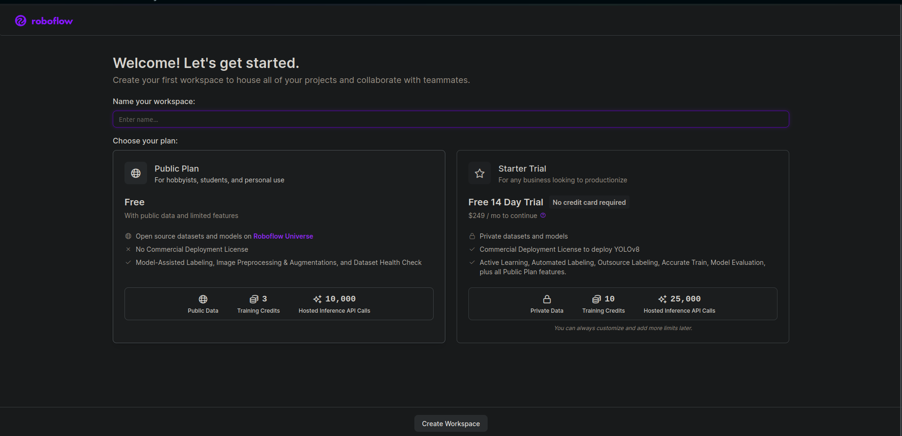

Jika kalian berhasil membuat akun, akan masuk ke page diatas. Disini kita bisa membuat workspace, misal `Banyubramanta`. (Pilih public plan, skip invite teammates untuk sekarang)

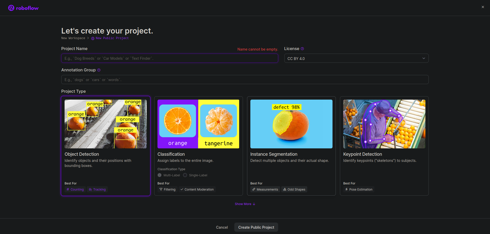

Setelah membuat workspace, kalian akan membuat project. Untuk nama project terserah, misal `test`. Untuk annotation group karena tidak boleh kosong, samakan saja dengan objek yang ingin kalian deteksi.

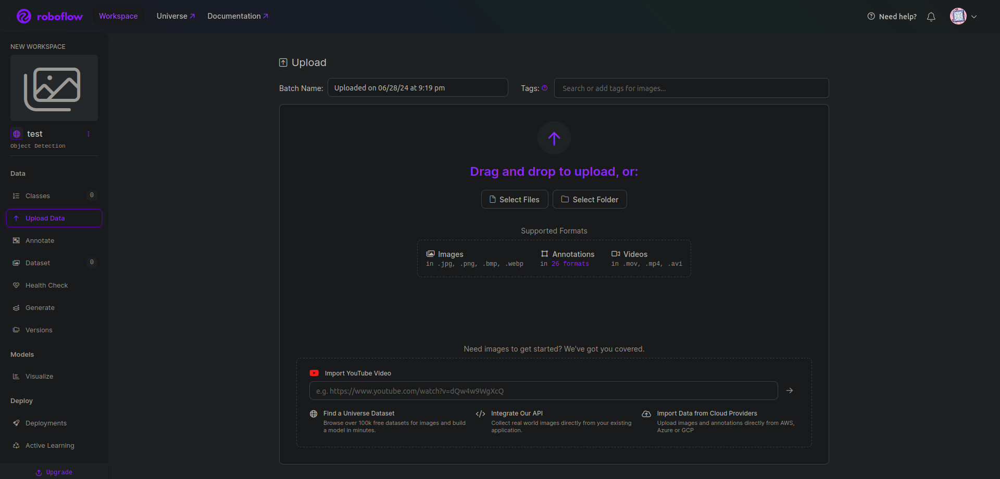

Sekarang kalian bisa mengupload video kalian. Karena ini hanya untuk keperluan pembelajaran, tidak perlu image hasil pecahan yang banyak, jadi bisa coba setting frame rate yang outputnya menghasilkan 15-30 image saja.

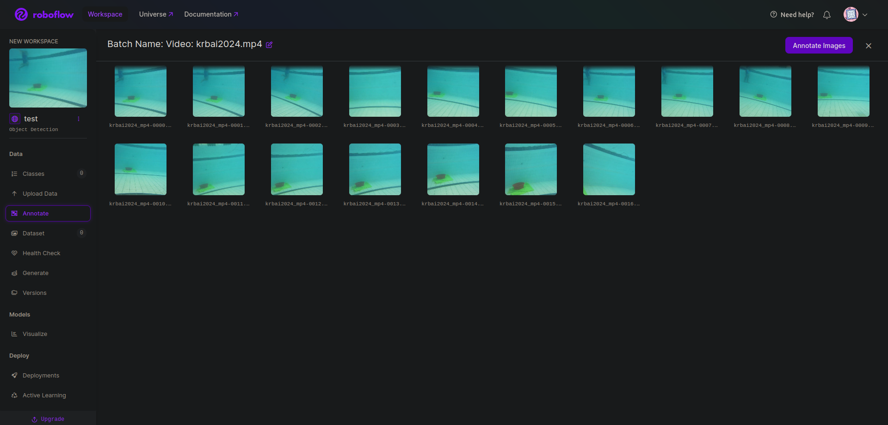

Masuk ke tahap paling seru (nuh uh), annotation/labelling data (Tab `Annotate`). Sekarang kalian akan secara manual melakukan labelling dataset yang sudah kalian upload. Kalian bisa memulai dari image pertama.

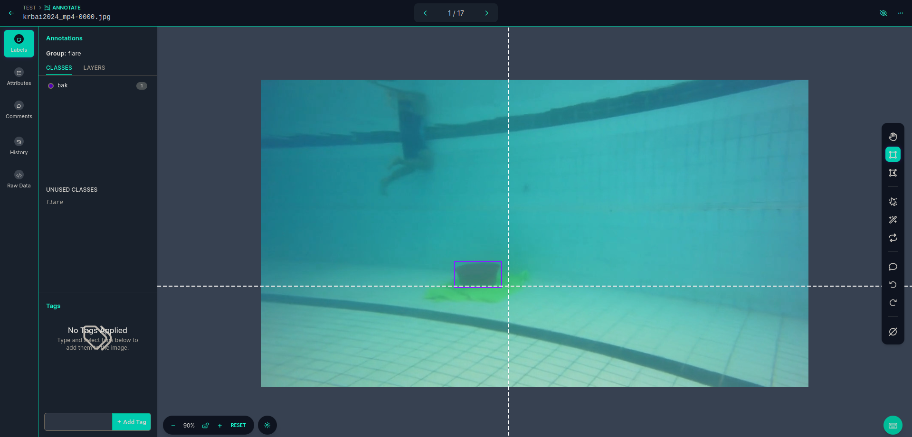

Karena YOLO bekerja dengan bounding boxes, maka kita pun melakukan labelling data dengan bounding box. Pastikan bounding box yang kalian buat akurat, karena itu akan mempengaruhi kinerja YOLO nantinya.

Untuk class, misal kalian hanya deteksi satu objek, maka tidak perlu membuat banyak class, cukup class untuk objek itu saja. Tetapi misal kalian ingin mendeteksi banyak objek, maka kalian perlu membuat class yang sesuai dengan objek kalian dan melakukan labelling dengan banyak class. Misal kalian sudah selesai melakukan labelling, maka kalian bisa menambahkannya ke dataset dengan tombol `Add n images to dataset`.

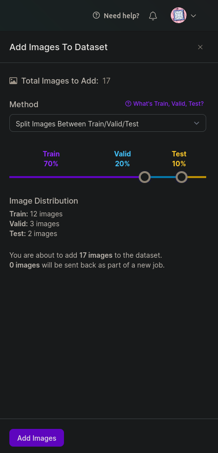

Untuk konfigurasi ini kalian bisa bereksperimen, tetapi kombinasi 70-15-15 merupakan salah satu kombinasi yang bisa kalian coba.

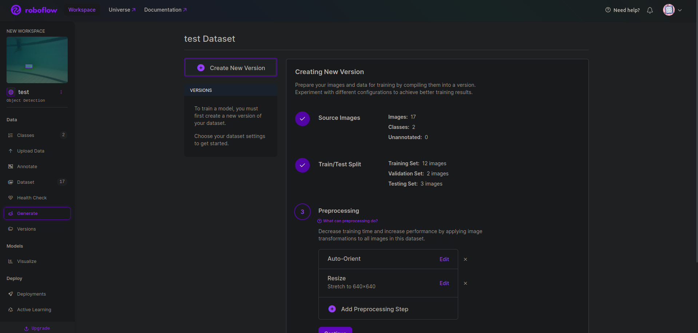

Sekarang kalian bisa melakukan generate dataset (Tab `Generate`). Jika kalian sudah melakukan tahap labelling dengan benar, dua point pertama seharusnya sudah selesai. Kalian sekarang bisa menambahkan preprocessing dan augmentation yang kalian inginkan.

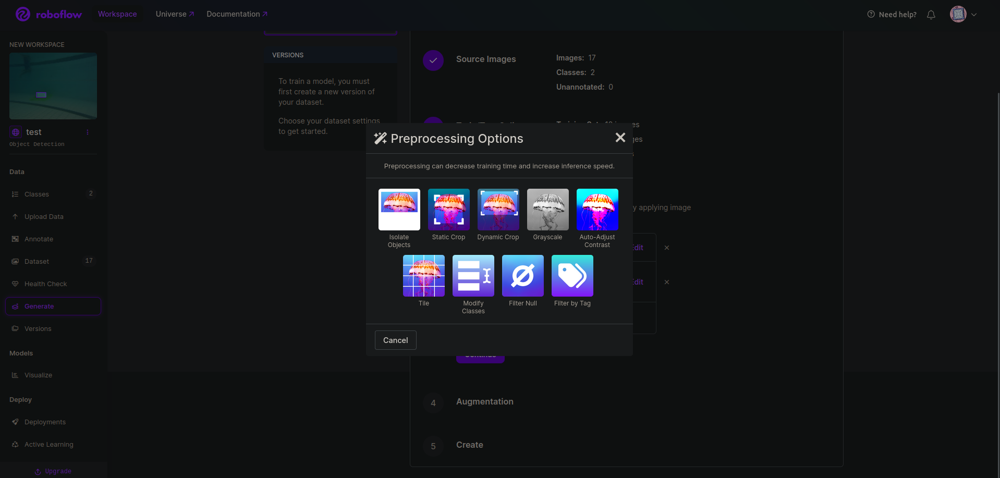
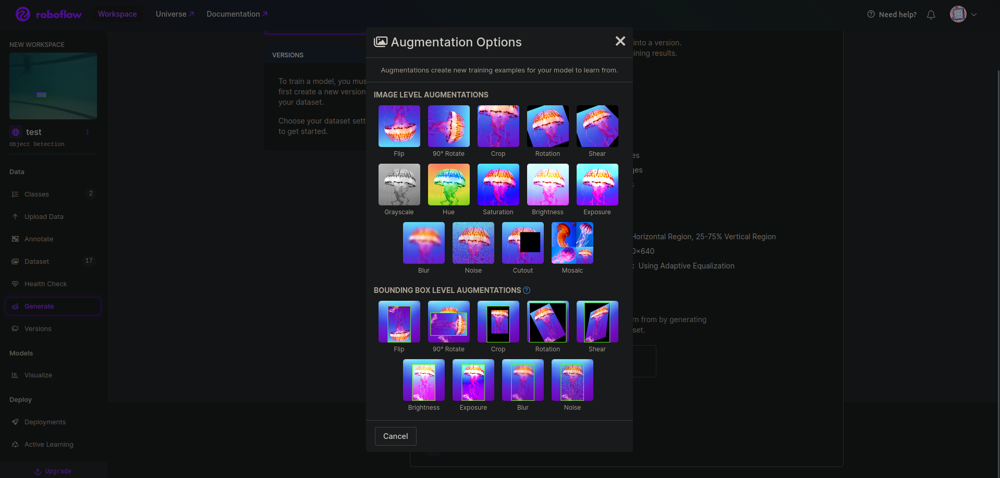
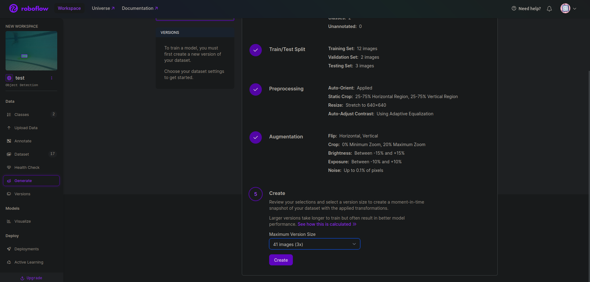

Jika sudah memilih preprocessing & augmentation yang kalian inginkan, sekarang kalian bisa membuat dataset dari gambar/video kalian.

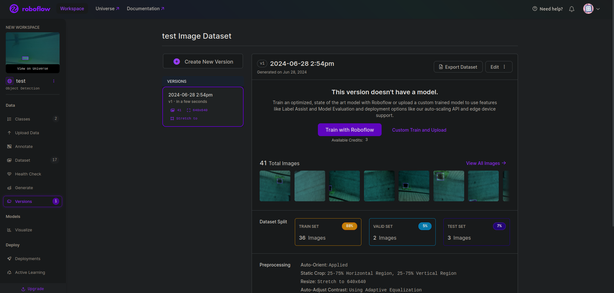

Sekarang kalian lanjut ke tahap **training** dataset yang kalian buat!

**Training**

Kalian bisa memilih opsi `custom train and upload` di page versions. Kalian bisa memilih antara YOLOv5/v8, tetapi disarankan mencoba YOLOv5 dulu (lebih ringan). Seharusnya kalian akan mendapatkan code snippet yang bisa dimasukkan ke Jupyter Notebook untuk training. Setelah ini, kalian bisa masuk ke sini:

[Custom Training with YOLOv5](https://colab.research.google.com/github/roboflow-ai/yolov5-custom-training-tutorial/blob/main/yolov5-custom-training.ipynb)

Code snippet yang kalian dapatkan tadi bisa dimasukkan di sini: (untuk dua code block diatas bisa dihapus)

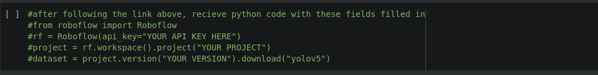

Kemudian kalian bisa run command dibawahnya, yaitu:

```jupyter
!python train.py --img 640 --batch 16 --epochs 10 --data {dataset.location}/data.yaml --weights yolov5s.pt --cache
```

Untuk img bawaan 416, bisa kalian ganti ke dimensi sesuai dataset kalian. Untuk epoch bawaan 150, itu memakan waktu lama dan cocok ke dataset yang besar, jadi kalian bisa memakai epoch +-10. Jika sukses maka akan muncul model yang telah ditrain.

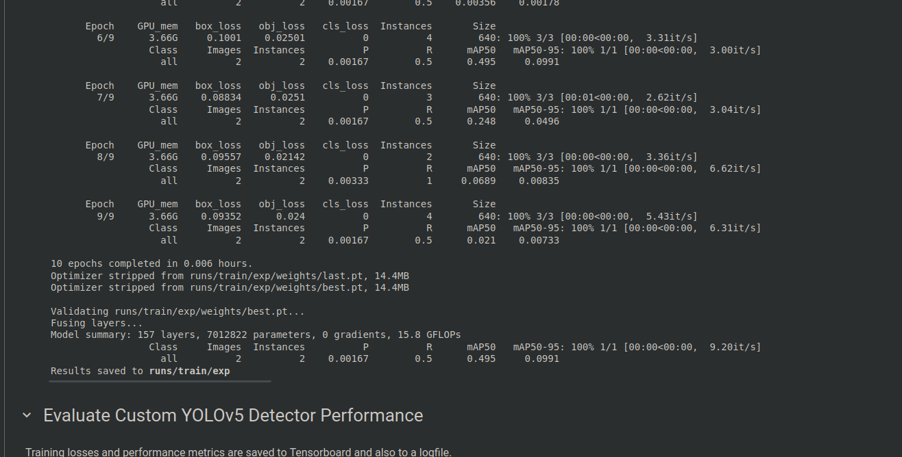
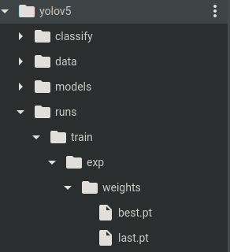

Kalian bisa download file `best.pt` karena itu file hasil training ini. Sekarang kalian bisa menggunakannya di program YOLO kalian. Misal kalian ingin mencoba dengan program bawaan YOLO, bisa dengan command berikut:

```python
python3 detect.py --weights <path_file.pt> --source 0
```

Untuk YOLOv8, kalian bisa mengganti path ke file .pt kalian.

```python
model = YOLO("<path__file.pt>")
```

## Integrasi dengan ROS2

## YOLO di C++